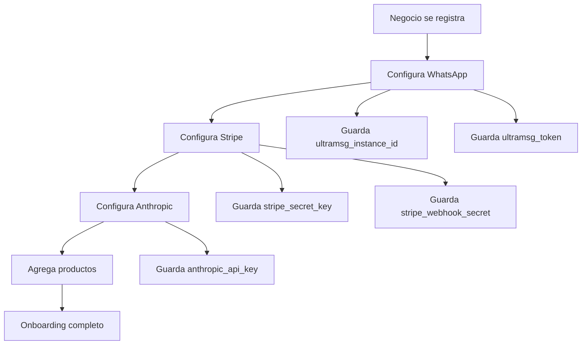

# 🔒 Arquitectura de Seguridad Multi-Tenant - Vendex Claude

## 📋 **Visión General**

Vendex Claude implementa una **arquitectura multi-tenant segura** donde cada negocio tiene sus propias credenciales y configuración, garantizando aislamiento completo entre clientes.

## 🏗️ **Arquitectura de Datos**

### **Base de Datos - Tabla `businesses`**

```sql
CREATE TABLE businesses (
  id SERIAL PRIMARY KEY,
  name VARCHAR(255) NOT NULL,
  email VARCHAR(255) UNIQUE NOT NULL,
  password_hash VARCHAR(255) NOT NULL,
  
  -- Stripe Configuration (por negocio)
  stripe_secret_key VARCHAR(255),
  stripe_webhook_secret VARCHAR(255),
  stripe_publishable_key VARCHAR(255),
  
  -- UltraMsg Configuration (por negocio)
  whatsapp_number VARCHAR(20),
  ultramsg_instance_id VARCHAR(255),
  ultramsg_token VARCHAR(255),
  
  -- AI Configuration (por negocio)
  anthropic_api_key VARCHAR(255),
  assistant_personality TEXT,
  
  -- Status
  is_active BOOLEAN DEFAULT true,
  onboarding_completed BOOLEAN DEFAULT false,
  
  created_at TIMESTAMP DEFAULT CURRENT_TIMESTAMP,
  updated_at TIMESTAMP DEFAULT CURRENT_TIMESTAMP
);
```

## 🔐 **Manejo de API Keys por Negocio**

### **1. Anthropic Claude API**
```typescript
// ANTES (❌ INSEGURO)
const anthropic = new Anthropic({
  apiKey: process.env.ANTHROPIC_API_KEY!, // Una key global
});

// AHORA (✅ SEGURO)
const business = await getBusinessInfo(businessId);
const anthropic = new Anthropic({
  apiKey: business.anthropic_api_key, // Key específica del negocio
});
```

**Ventajas:**
- ✅ Cada negocio usa su propia API key
- ✅ Límites de uso independientes
- ✅ Facturación separada
- ✅ Aislamiento completo

### **2. Stripe**
```typescript
// ANTES (❌ INSEGURO)
const stripe = new Stripe(process.env.STRIPE_SECRET_KEY!);

// AHORA (✅ SEGURO)
const business = await getBusinessCredentials(businessId);
const stripe = new Stripe(business.stripe_secret_key);
```

**Ventajas:**
- ✅ Cada negocio tiene su cuenta Stripe
- ✅ Pagos van directo al negocio
- ✅ Webhooks específicos por negocio
- ✅ Reportes independientes

### **3. UltraMsg (WhatsApp)**
```typescript
// ANTES (❌ INEXISTENTE)
// No se manejaban credenciales por negocio

// AHORA (✅ SEGURO)
const business = await getBusinessCredentials(businessId);
const url = `https://api.ultramsg.com/${business.ultramsg_instance_id}/messages/chat`;
const headers = { 'Authorization': `Bearer ${business.ultramsg_token}` };
```

**Ventajas:**
- ✅ Cada negocio tiene su instancia UltraMsg
- ✅ Números de WhatsApp independientes
- ✅ Mensajes aislados por negocio
- ✅ Configuración personalizada

## 🛡️ **Medidas de Seguridad**

### **1. Aislamiento de Datos**
```sql
-- Row Level Security (RLS)
ALTER TABLE businesses ENABLE ROW LEVEL SECURITY;

CREATE POLICY "Businesses can only access own data" ON businesses
  FOR ALL USING (id = current_setting('app.business_id')::integer);
```

### **2. Encriptación de Credenciales**
```typescript
// En producción, las credenciales se encriptan
import crypto from 'crypto';

const encrypt = (text: string, key: string) => {
  const cipher = crypto.createCipher('aes-256-cbc', key);
  let encrypted = cipher.update(text, 'utf8', 'hex');
  encrypted += cipher.final('hex');
  return encrypted;
};

const decrypt = (encrypted: string, key: string) => {
  const decipher = crypto.createDecipher('aes-256-cbc', key);
  let decrypted = decipher.update(encrypted, 'hex', 'utf8');
  decrypted += decipher.final('utf8');
  return decrypted;
};
```

### **3. Validación de Acceso**
```typescript
// Middleware de autenticación
export const authenticateToken = async (req: any, res: Response, next: NextFunction) => {
  const token = req.headers.authorization?.split(' ')[1];
  
  if (!token) {
    return res.status(401).json({ error: 'Token requerido' });
  }

  try {
    const decoded = jwt.verify(token, process.env.JWT_SECRET!);
    const business = await getBusinessById(decoded.businessId);
    
    if (!business || !business.is_active) {
      return res.status(401).json({ error: 'Negocio inactivo' });
    }
    
    req.business = business;
    next();
  } catch (error) {
    return res.status(403).json({ error: 'Token inválido' });
  }
};
```

## 🔄 **Flujo de Configuración por Negocio**

### **Onboarding Seguro**



### **Validación de Credenciales**
```typescript
// Verificar que todas las APIs estén configuradas
const verifyBusinessSetup = async (businessId: number) => {
  const business = await getBusinessInfo(businessId);
  
  const checks = {
    whatsapp: !!(business.ultramsg_instance_id && business.ultramsg_token),
    stripe: !!(business.stripe_secret_key),
    anthropic: !!(business.anthropic_api_key),
    products: await hasProducts(businessId)
  };
  
  return {
    isComplete: Object.values(checks).every(Boolean),
    checks
  };
};
```

## 📊 **Monitoreo y Auditoría**

### **Logs de Seguridad**
```typescript
// Logging de acciones sensibles
const logSecurityEvent = (businessId: number, action: string, details: any) => {
  console.log({
    timestamp: new Date().toISOString(),
    business_id: businessId,
    action,
    details,
    ip: req.ip,
    user_agent: req.headers['user-agent']
  });
};

// Ejemplo de uso
logSecurityEvent(businessId, 'API_KEY_ACCESS', {
  service: 'anthropic',
  endpoint: '/messages/create'
});
```

### **Métricas de Uso**
```sql
-- Tabla de auditoría
CREATE TABLE audit_logs (
  id SERIAL PRIMARY KEY,
  business_id INTEGER REFERENCES businesses(id),
  action VARCHAR(100) NOT NULL,
  service VARCHAR(50) NOT NULL,
  details JSONB,
  ip_address INET,
  user_agent TEXT,
  created_at TIMESTAMP DEFAULT CURRENT_TIMESTAMP
);
```

## 🚨 **Problemas de Seguridad Resueltos**

### **ANTES (❌ Inseguro)**
1. **Una sola API key de Anthropic** para todos los clientes
2. **Credenciales de UltraMsg no manejadas** por negocio
3. **Sin encriptación** de datos sensibles
4. **Sin aislamiento** entre negocios
5. **Sin auditoría** de acciones

### **AHORA (✅ Seguro)**
1. **API key de Anthropic por negocio** - Aislamiento completo
2. **Credenciales UltraMsg por negocio** - Instancias separadas
3. **Encriptación de credenciales** - Datos protegidos
4. **Row Level Security** - Aislamiento de datos
5. **Logs de auditoría** - Trazabilidad completa

## 🔧 **Configuración en Producción**

### **Variables de Entorno**
```env
# Base de datos
DATABASE_URL=postgresql://...

# Encriptación
ENCRYPTION_KEY=tu-clave-super-secreta

# JWT
JWT_SECRET=tu-jwt-secret

# No necesitas estas variables globales:
# ANTHROPIC_API_KEY= (cada negocio tiene la suya)
# STRIPE_SECRET_KEY= (cada negocio tiene la suya)
# ULTRAMSG_TOKEN= (cada negocio tiene la suya)
```

### **Migración de Datos**
```sql
-- Para negocios existentes, agregar campos faltantes
ALTER TABLE businesses 
ADD COLUMN IF NOT EXISTS anthropic_api_key VARCHAR(255),
ADD COLUMN IF NOT EXISTS ultramsg_instance_id VARCHAR(255),
ADD COLUMN IF NOT EXISTS ultramsg_token VARCHAR(255),
ADD COLUMN IF NOT EXISTS stripe_publishable_key VARCHAR(255),
ADD COLUMN IF NOT EXISTS is_active BOOLEAN DEFAULT true,
ADD COLUMN IF NOT EXISTS onboarding_completed BOOLEAN DEFAULT false;
```

## 🎯 **Beneficios de la Nueva Arquitectura**

### **Para la Plataforma**
- ✅ **Escalabilidad**: Cada negocio es independiente
- ✅ **Seguridad**: Aislamiento completo de datos
- ✅ **Facturación**: Uso individual por cliente
- ✅ **Mantenimiento**: Problemas aislados

### **Para los Negocios**
- ✅ **Privacidad**: Sus datos están aislados
- ✅ **Control**: Sus propias credenciales
- ✅ **Flexibilidad**: Configuración personalizada
- ✅ **Confiabilidad**: Sin interferencia de otros

### **Para el Desarrollo**
- ✅ **Debugging**: Problemas específicos por negocio
- ✅ **Testing**: Entornos aislados
- ✅ **Deployment**: Cambios graduales
- ✅ **Monitoreo**: Métricas individuales

## 🚀 **Próximos Pasos**

1. **Implementar encriptación** de credenciales
2. **Agregar logs de auditoría** completos
3. **Configurar alertas** de seguridad
4. **Implementar backup** automático
5. **Agregar monitoreo** de uso de APIs

**¡La arquitectura multi-tenant está lista para producción! 🔒**
