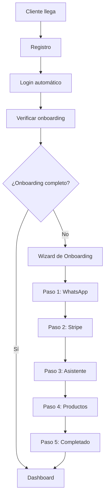

# 🚀 Flujo de Onboarding Autónomo - Vendex Claude

## 📋 **Visión General**

El sistema permite que **cualquier negocio se registre y configure su asistente de ventas de forma completamente autónoma**, sin necesidad de asistencia técnica.

## 🎯 **Flujo Completo del Cliente (Negocio)**

### **1. Registro Inicial**
```
Cliente → VendexClaude.com → "Registrar mi Negocio"
```

**Formulario de Registro:**
- Nombre del negocio
- Tipo de negocio (restaurante, tienda, servicios, etc.)
- Descripción del negocio
- Teléfono de contacto
- Email del administrador
- Contraseña

### **2. Wizard de Onboarding (5 Pasos)**

#### **Paso 1: Configurar WhatsApp**
- **Objetivo**: Conectar el WhatsApp del negocio
- **Proceso**:
  - Ingresar número de WhatsApp
  - Explicación de UltraMsg
  - Link a guía de configuración
  - Validación del número

#### **Paso 2: Configurar Pagos (Stripe)**
- **Objetivo**: Habilitar procesamiento de pagos
- **Proceso**:
  - Ingresar Stripe Secret Key
  - Webhook Secret (opcional)
  - Validación de credenciales
  - Link a Stripe Dashboard

#### **Paso 3: Personalizar Asistente IA**
- **Objetivo**: Definir personalidad del asistente
- **Proceso**:
  - Seleccionar plantilla (Amigable, Profesional, Entusiasta, Experto)
  - Personalizar descripción
  - Consejos para buena personalidad
  - Vista previa de comportamiento

#### **Paso 4: Agregar Productos**
- **Objetivo**: Cargar catálogo inicial
- **Proceso**:
  - Formulario para agregar productos
  - Nombre, precio, stock, descripción
  - Lista de productos agregados
  - Mínimo 1 producto requerido

#### **Paso 5: ¡Listo para Vender!**
- **Objetivo**: Confirmar configuración completa
- **Proceso**:
  - Resumen de configuración
  - Próximos pasos
  - Acceso al dashboard

## 🔄 **Flujo Técnico Detallado**

### **Registro → Onboarding → Dashboard**



### **Validaciones por Paso**

#### **WhatsApp**
- ✅ Número válido
- ✅ Formato internacional
- ✅ No duplicado en el sistema

#### **Stripe**
- ✅ Secret Key válida
- ✅ Webhook Secret válido (si se proporciona)
- ✅ Conexión exitosa con Stripe

#### **Asistente**
- ✅ Personalidad definida
- ✅ Mínimo 50 caracteres
- ✅ No contenido inapropiado

#### **Productos**
- ✅ Al menos 1 producto
- ✅ Precio válido
- ✅ Stock válido
- ✅ Descripción completa

## 🎨 **Experiencia de Usuario**

### **Diseño del Wizard**
- **Progress Bar**: Visual del progreso
- **Indicadores de Pasos**: Iconos y estados
- **Navegación**: Anterior/Siguiente
- **Validación en Tiempo Real**: Feedback inmediato

### **Ayuda Contextual**
- **Tooltips**: Explicaciones breves
- **Guías**: Links a documentación
- **Ejemplos**: Casos de uso reales
- **Consejos**: Mejores prácticas

### **Estados de Carga**
- **Loading**: Indicadores de progreso
- **Error**: Mensajes claros
- **Éxito**: Confirmaciones visuales

## 🔧 **Configuración Técnica**

### **Base de Datos**
```sql
-- Verificar estado de onboarding
SELECT 
    whatsapp_number IS NOT NULL as has_whatsapp,
    stripe_secret_key IS NOT NULL as has_stripe,
    assistant_personality IS NOT NULL as has_assistant,
    (SELECT COUNT(*) FROM products WHERE business_id = b.id) > 0 as has_products
FROM businesses b
WHERE id = ?
```

### **Validaciones Backend**
```javascript
// Verificar onboarding completo
const isOnboardingComplete = (business) => {
  return business.whatsappNumber &&
         business.stripeSecretKey &&
         business.assistantPersonality &&
         business.productsCount > 0;
};
```

### **Redirecciones Frontend**
```dart
// Lógica de navegación
if (businessProvider.onboardingCompleted) {
  return DashboardScreen();
} else {
  return OnboardingScreen();
}
```

## 🚀 **Ventajas del Sistema**

### **Para el Negocio**
- ✅ **Configuración en 10 minutos**
- ✅ **Sin asistencia técnica**
- ✅ **Personalización completa**
- ✅ **Inicio inmediato**

### **Para la Plataforma**
- ✅ **Escalabilidad automática**
- ✅ **Reducción de soporte**
- ✅ **Onboarding estandarizado**
- ✅ **Datos consistentes**

## 📊 **Métricas de Onboarding**

### **KPIs a Medir**
- **Tasa de Completación**: % que termina onboarding
- **Tiempo Promedio**: Minutos para completar
- **Abandono por Paso**: Dónde se pierden usuarios
- **Errores Comunes**: Problemas frecuentes

### **Optimizaciones**
- **A/B Testing**: Diferentes flujos
- **Simplificación**: Reducir pasos
- **Ayuda Contextual**: Mejorar guías
- **Validación**: Prevenir errores

## 🎯 **Casos de Uso**

### **Restaurante**
1. **WhatsApp**: Número del local
2. **Stripe**: Cuenta de restaurante
3. **Asistente**: "Amigable, conoce el menú"
4. **Productos**: Platos principales

### **Tienda Online**
1. **WhatsApp**: Número de atención
2. **Stripe**: Cuenta de comercio
3. **Asistente**: "Profesional, experto en productos"
4. **Productos**: Catálogo completo

### **Servicios**
1. **WhatsApp**: Número de contacto
2. **Stripe**: Cuenta de servicios
3. **Asistente**: "Experto técnico"
4. **Productos**: Servicios disponibles

## 🎉 **Resultado Final**

**Cada negocio tendrá:**
- ✅ WhatsApp conectado
- ✅ Pagos configurados
- ✅ Asistente personalizado
- ✅ Productos cargados
- ✅ Dashboard funcional

**¡Listo para recibir clientes y generar ventas automáticamente! 🚀**
